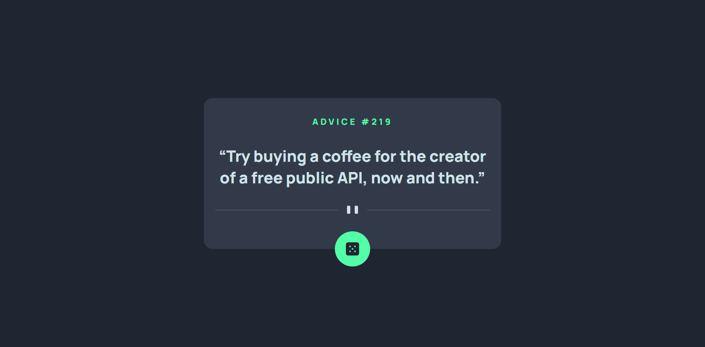

# Frontend Mentor - Advice generator app solution

This is a solution to the [Advice generator app challenge on Frontend Mentor](https://www.frontendmentor.io/challenges/advice-generator-app-QdUG-13db). Frontend Mentor challenges help you improve your coding skills by building realistic projects.

## Table of contents

- [Frontend Mentor - Advice generator app solution](#frontend-mentor---advice-generator-app-solution)
  - [Table of contents](#table-of-contents)
  - [Overview](#overview)
    - [The challenge](#the-challenge)
    - [Screenshot](#screenshot)
    - [Links](#links)
  - [My process](#my-process)
    - [Built with](#built-with)
    - [What I learned](#what-i-learned)
    - [Useful resources](#useful-resources)
  - [Author](#author)

## Overview

### The challenge

Users should be able to:

- Get Random Advice when clicking dice button

### Screenshot



### Links

- [Live Site](https://msuryaditriputrar.github.io/Front-End-Mentor/junior/advice-generator-app)
- [Solution](https://github.com/msuryaditriputraR/Front-End-Mentor/tree/master/junior/advice-generator-app)

## My process

### Built with

- Semantic HTML5 markup
- CSS VARIABLE
- CSS Grid
- BEM Methodology
- Hover State
- Mobile-first workflow
- Fetch Javascript API


### What I learned

Learn how to get data from public API


```js
/* === FUNCTION GET ADVICE === */
const getAdvice = () => {
    const url = "https://api.adviceslip.com/advice";

    fetch(url, { cache: "no-cache" })
        .then((respon) => respon.json())
        .then((data) => data.slip)
        .then((slip) => {
            adviceTag.innerText = slip.id;
            qoute.innerText = slip.advice;
        })
        .catch((error) => {
            console.error(error);
        });
};
```

### Useful resources

- [BEM Methodology](https://getbem.com/) - Learn more about Block Element Modifier (BEM) CSS Methodology
- [W3schools](https://www.w3schools.com/) - Unofficial web programming documentation but interactive and detailed
- [MDN](https://developer.mozilla.org/en-US/) = Mozilla Developer Network is Resource for developer and its documentation is very complete and detailed
## Author

- Frontend Mentor - [@msuryaditriputraR](https://www.frontendmentor.io/profile/msuryaditriputraR)
- LinkedIn - [msuryaditriputra](https://www.linkedin.com/in/msuryaditriputra/)