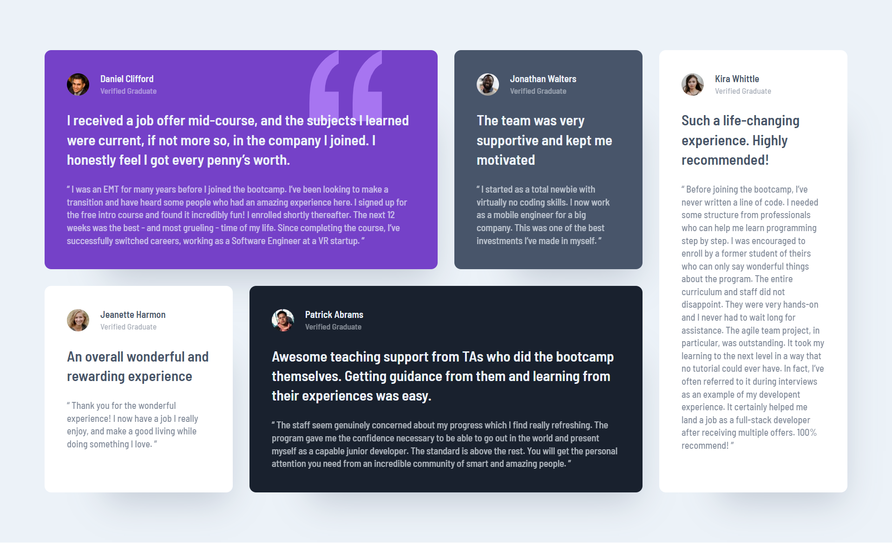

# Frontend Mentor - Testimonials grid section solution

This is a solution to the [Testimonials grid section challenge on Frontend Mentor](https://www.frontendmentor.io/challenges/testimonials-grid-section-Nnw6J7Un7). Frontend Mentor challenges help you improve your coding skills by building realistic projects. 

## Table of contents

- [Frontend Mentor - Testimonials grid section solution](#frontend-mentor---testimonials-grid-section-solution)
  - [Table of contents](#table-of-contents)
  - [Overview](#overview)
    - [The challenge](#the-challenge)
    - [Screenshot](#screenshot)
    - [Links](#links)
  - [My process](#my-process)
    - [Built with](#built-with)
    - [What I learned](#what-i-learned)
    - [Useful resources](#useful-resources)
  - [Author](#author)

## Overview

### The challenge

Users should be able to:

- View the optimal layout for the site depending on their device's screen size

### Screenshot



### Links

- [Live Site](https://msuryaditriputrar.github.io/Front-End-Mentor/junior/testimonials-grid-section)
- [Solution](https://github.com/msuryaditriputraR/Front-End-Mentor/tree/master/junior/testimonials-grid-section)

## My process

### Built with

- Semantic HTML5 markup
- CSS VARIABLE
- CSS Grid
- BEM Methodology
- Hover State
- Mobile-first workflow

### What I learned

Manage the layout appearance using CSS Grid so we can easily adapt it to the design and its responsive

```css
@media screen and (min-width: 785px) {
    .cards {
        grid-template-columns: repeat(3, 1fr);
    }

    .card--purple {
        background-position: right 5rem top;
        grid-column: 1 / 3;
    }

    .card--grayish-blue {
        grid-column: 3 / 4;
    }

    .card--white:first-child {
        grid-column: 1 / 2;
    }

    .card--blackish-blue {
        grid-column: 2 / 4;
    }

    .card--white:last-child {
        grid-column: 1 / 4;
    }
}

/* === LARGE DEVICE === */
@media screen and (min-width: 1000px) {
    .cards {
        grid-template-columns: repeat(4, 1fr);
    }

    .card--white:last-child {
        grid-row: 1 / 3;
        grid-column: 4;
    }
}
```

### Useful resources

- [BEM Methodology](https://getbem.com/) - Learn more about Block Element Modifier (BEM) CSS Methodology
- [W3schools](https://www.w3schools.com/) - Unofficial web programming documentation but interactive and detailed
- [MDN](https://developer.mozilla.org/en-US/) = Mozilla Developer Network is Resource for developer and its documentation is very complete and detailed
## Author

- Frontend Mentor - [@msuryaditriputraR](https://www.frontendmentor.io/profile/msuryaditriputraR)
- LinkedIn - [msuryaditriputra](https://www.linkedin.com/in/msuryaditriputra/)
