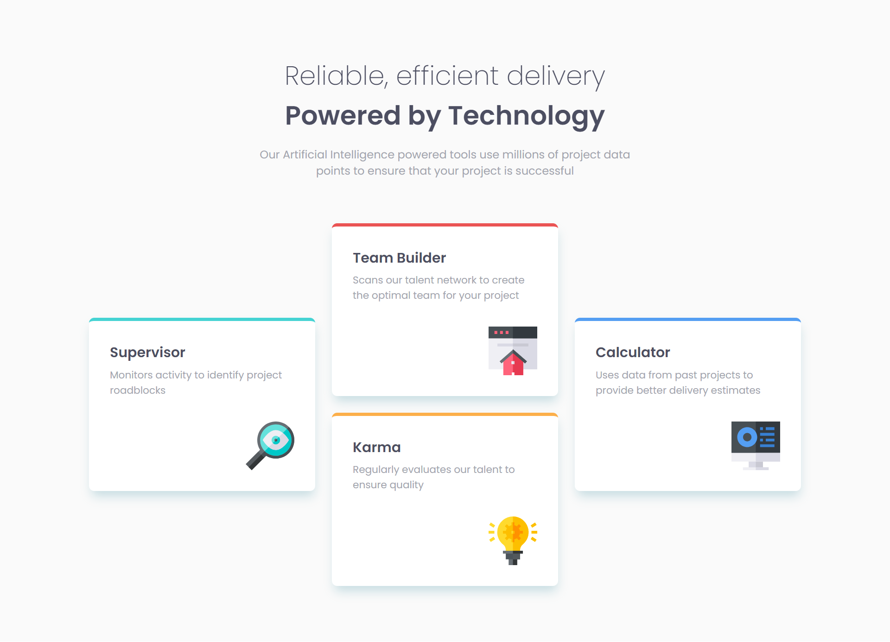

# Frontend Mentor - Four card feature section solution

This is a solution to the [Four card feature section challenge on Frontend Mentor](https://www.frontendmentor.io/challenges/four-card-feature-section-weK1eFYK). Frontend Mentor challenges help you improve your coding skills by building realistic projects. 

## Table of contents

- [Frontend Mentor - Four card feature section solution](#frontend-mentor---four-card-feature-section-solution)
  - [Table of contents](#table-of-contents)
  - [Overview](#overview)
    - [The challenge](#the-challenge)
    - [Screenshot](#screenshot)
    - [Links](#links)
  - [My process](#my-process)
    - [Built with](#built-with)
    - [What I learned](#what-i-learned)
  - [Author](#author)

## Overview

### The challenge

Users should be able to:

- View the optimal layout for the site depending on their device's screen size

### Screenshot



### Links

- [Live Site](https://msuryaditriputrar.github.io/Front-End-Mentor/newbie/four-card-feature-section/)
- [Solution](https://github.com/msuryaditriputraR/Front-End-Mentor/tree/master/newbie/four-card-feature-section/)

## My process

### Built with

- Semantic HTML5 markup
- CSS VARIABLE
- CSS Grid
- BEM Methodology
- Mobile-first workflow

### What I learned

Responsive Design easily using Grid 

```css
@media screen and (min-width: 785px) {
    .cards {
        grid-template-columns: repeat(2, 1fr);
    }
}

@media screen and (min-width: 1000px) {
    .cards {
        grid-template-rows: repeat(4, 1fr);
        grid-template-columns: repeat(3, 1fr);
    }

    .card.border-cyan,
    .card.border-blue {
        grid-row-start: 2;
        grid-row-end: 4;
    }

    .card.border-red {
        grid-row-start: 1;
        grid-row-end: 3;
    }

    .card.border-orange {
        grid-row-start: 3;
        grid-row-end: 5;
    }
}
```

## Author

- Frontend Mentor - [@msuryaditriputraR](https://www.frontendmentor.io/profile/msuryaditriputraR)
- LinkedIn - [msuryaditriputra](https://www.linkedin.com/in/msuryaditriputra/)