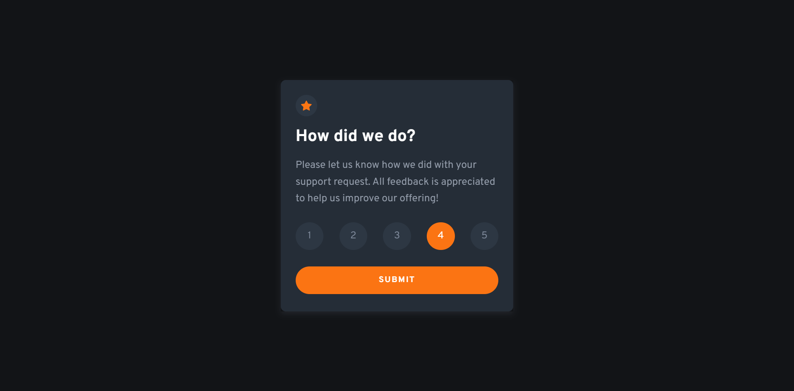
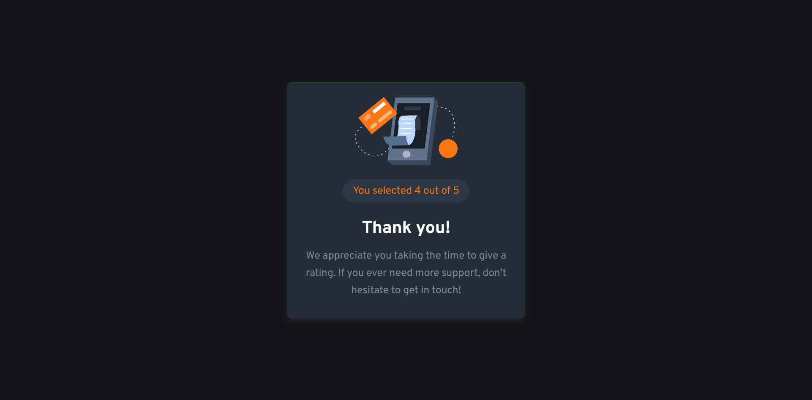

# Frontend Mentor - Interactive rating component solution

This is a solution to the [Interactive rating component challenge on Frontend Mentor](https://www.frontendmentor.io/challenges/interactive-rating-component-koxpeBUmI). Frontend Mentor challenges help you improve your coding skills by building realistic projects. 

## Table of contents

- [Frontend Mentor - Interactive rating component solution](#frontend-mentor---interactive-rating-component-solution)
  - [Table of contents](#table-of-contents)
  - [Overview](#overview)
    - [The challenge](#the-challenge)
    - [Screenshot](#screenshot)
    - [Links](#links)
  - [My process](#my-process)
    - [Built with](#built-with)
    - [What I learned](#what-i-learned)
  - [Author](#author)
  - [Acknowledgments](#acknowledgments)

## Overview

### The challenge

Users should be able to:

- View the optimal layout for the app depending on their device's screen size
- See hover states for all interactive elements on the page
- Select and submit a number rating
- See the "Thank you" card state after submitting a rating

### Screenshot




### Links

- [Live Site](https://msuryaditriputrar.github.io/Front-End-Mentor/newbie/interactive-rating-component)
- [Solution](https://github.com/msuryaditriputraR/Front-End-Mentor/tree/master/newbie/interactive-rating-component)

## My process

### Built with

- Semantic HTML5 markup
- CSS VARIABLE
- BEM Methodology
- Mobile-first workflow
- Javascript DOM

### What I learned

Create rating radio input dynamically with javascript DOM

```js
/* ==================== CREATE RADIOS ===================== */

function createRadio(name, index) {
    // Create Fragment as a container
    const fragment = document.createDocumentFragment();

    // create input tag and adding its attribute
    const input = document.createElement("input");
    input.type = "radio";
    input.name = name;
    input.id = `${name}-${index}`;
    input.className = "card__radio";
    input.value = index;

    // create label tag and adding its attribute
    const label = document.createElement("label");
    label.innerText = index;
    label.htmlFor = input.id;
    label.className = "card__label";

    // Add Input and Label to fragment element
    fragment.append(input, label);

    return fragment;
}

// Looping according to the number
let i = 1;
while (i <= 5) {
    // append radio fragment to radios
    radios.appendChild(createRadio("rating", i));
    i++;
}
```

Flip the card after rating submited.

```css
.card__content {
    position: relative;
    transition: transform 3s;
    transform-style: preserve-3d;
    height: calc(350px + 1.5rem);
    background-color: var(--dark-blue);
    border-radius: .5rem;
}

/* FLIP CARD */
.card.submit .card__content {
    transform: rotateY(.5turn);
}

.card__rating,
.card__thank {
    position: absolute;
    backface-visibility: hidden;
    padding: 1.5rem;
    transform: var(--translate-z);
}

```

## Author

- Frontend Mentor - [@msuryaditriputraR](https://www.frontendmentor.io/profile/msuryaditriputraR)
- LinkedIn - [msuryaditriputra](https://www.linkedin.com/in/msuryaditriputra/)