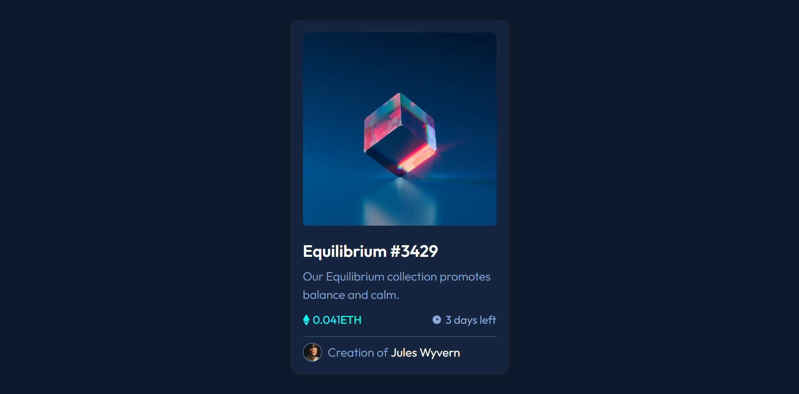

# Frontend Mentor - NFT preview card component solution

This is a solution to the [NFT preview card component challenge on Frontend Mentor](https://www.frontendmentor.io/challenges/nft-preview-card-component-SbdUL_w0U). Frontend Mentor challenges help you improve your coding skills by building realistic projects. 

## Table of contents

- [Frontend Mentor - NFT preview card component solution](#frontend-mentor---nft-preview-card-component-solution)
  - [Table of contents](#table-of-contents)
  - [Overview](#overview)
    - [The challenge](#the-challenge)
    - [Screenshot](#screenshot)
    - [Links](#links)
  - [My process](#my-process)
    - [Built with](#built-with)
    - [What I learned](#what-i-learned)
  - [Author](#author)

## Overview

### The challenge

Users should be able to:

- View the optimal layout depending on their device's screen size
- See hover states for interactive elements

### Screenshot



### Links

- [Live Site](https://msuryaditriputrar.github.io/Front-End-Mentor/newbie/nft-preview-card-component)
- [Solution](https://github.com/msuryaditriputraR/Front-End-Mentor/tree/master/newbie/nft-preview-card-component)

## My process

### Built with

- Semantic HTML5 markup
- CSS VARIABLE
- CSS Grid
- BEM Methodology
- Hover State
- Mobile-first workflow

### What I learned

Semantic css class with BEM Methodology

```html
<div class="card">
			<div class="card__image">
				<div class="overlay">
					
				</div>
				
			</div>
			<div class="card__body">
				<h1 class="card__title"></h1>
				<p class="card__description"></p>
				<div class="card__info">
					<span class="card__prize">
					</span>
					<span class="card__time">
					</span>
				</div>
			</div>
			<div class="card__footer">
				
				<div class="card__credit">
					<span class="card__name"></span>
				</div>
			</div>
		</div>
```

## Author

- Frontend Mentor - [@msuryaditriputraR](https://www.frontendmentor.io/profile/msuryaditriputraR)
- LinkedIn - [msuryaditriputra](https://www.linkedin.com/in/msuryaditriputra/)