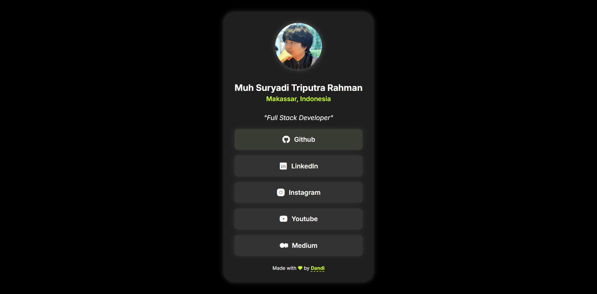

# Frontend Mentor - Social links profile solution

This is a solution to the [Social links profile challenge on Frontend Mentor](https://www.frontendmentor.io/challenges/social-links-profile-UG32l9m6dQ). Frontend Mentor challenges help you improve your coding skills by building realistic projects. 

## Table of contents

- [Frontend Mentor - Social links profile solution](#frontend-mentor---social-links-profile-solution)
  - [Table of contents](#table-of-contents)
  - [Overview](#overview)
    - [The challenge](#the-challenge)
    - [Screenshot](#screenshot)
    - [Links](#links)
  - [My process](#my-process)
    - [Built with](#built-with)
    - [What I learned](#what-i-learned)
    - [Continued development](#continued-development)
  - [Author](#author)

**Note: Delete this note and update the table of contents based on what sections you keep.**

## Overview

### The challenge

Users should be able to:

- See hover and focus states for all interactive elements on the page

### Screenshot



### Links

- [Solution](https://github.com/msuryaditriputraR/Front-End-Mentor/tree/master/newbie/social-links-profile)
- [Live Site](https://msuryaditriputrar.github.io/Front-End-Mentor/newbie/social-links-profile)

## My process

### Built with

- HTML
- CSS 
- JS
- Mobile-first workflow

### What I learned

I create link button component using Javascript, So I can create links dynamically 

```js
export default function ({ href, icon, text }) {
    const a = document.createElement("a");

    a.href = href || "#";
    a.classList.add("card__link");
    a.setAttribute("target", "_blank");
    a.setAttribute("rel", "noopener noreferrer");

    const i = document.createElement("i");
    i.classList.add(icon);

    a.append(i, text);

    return a;
}
```

### Continued development

In the future I want to make a CMS for this app, so we can create link in User Interface not from code directly


## Author

- Frontend Mentor - [@msuryaditriputraR](https://www.frontendmentor.io/profile/msuryaditriputraR)

