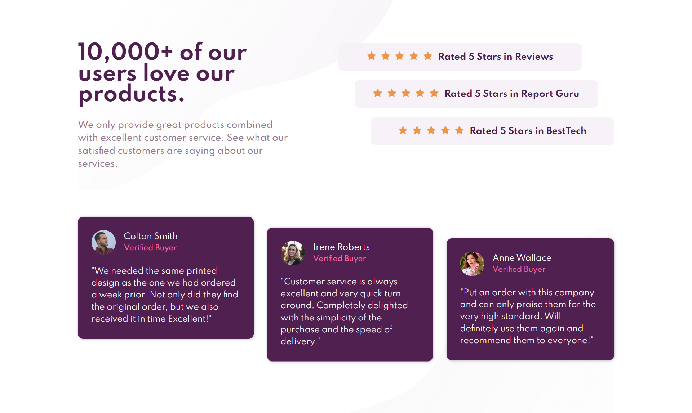

# Frontend Mentor - Social proof section solution

This is a solution to the [Social proof section challenge on Frontend Mentor](https://www.frontendmentor.io/challenges/social-proof-section-6e0qTv_bA). Frontend Mentor challenges help you improve your coding skills by building realistic projects. 

## Table of contents

- [Frontend Mentor - Social proof section solution](#frontend-mentor---social-proof-section-solution)
  - [Table of contents](#table-of-contents)
  - [Overview](#overview)
    - [The challenge](#the-challenge)
    - [Screenshot](#screenshot)
    - [Links](#links)
    - [Built with](#built-with)
    - [Useful resources](#useful-resources)
  - [Author](#author)

**Note: Delete this note and update the table of contents based on what sections you keep.**

## Overview

### The challenge

Users should be able to:

- View the optimal layout for the section depending on their device's screen size

### Screenshot

### Links

- [Live Site](https://msuryaditriputrar.github.io/Front-End-Mentor/newbie/social-proof-section)
- [Solution](https://github.com/msuryaditriputraR/Front-End-Mentor/tree/master/newbie/social-proof-section)

### Built with

- Semantic HTML5 markup
- CSS VARIABLE
- CSS Grid
- BEM Methodology
- Mobile-first workflow

### Useful resources

- [BEM Methodology](https://getbem.com/) - Learn more about Block Element Modifier (BEM) CSS Methodology
- [W3schools](https://www.w3schools.com/) - Unofficial web programming documentation but interactive and detailed
- [MDN](https://developer.mozilla.org/en-US/) = Mozilla Developer Network is Resource for developer and its documentation is very complete and detailed

## Author

- Frontend Mentor - [@msuryaditriputraR](https://www.frontendmentor.io/profile/msuryaditriputraR)
- LinkedIn - [msuryaditriputra](https://www.linkedin.com/in/msuryaditriputra/)